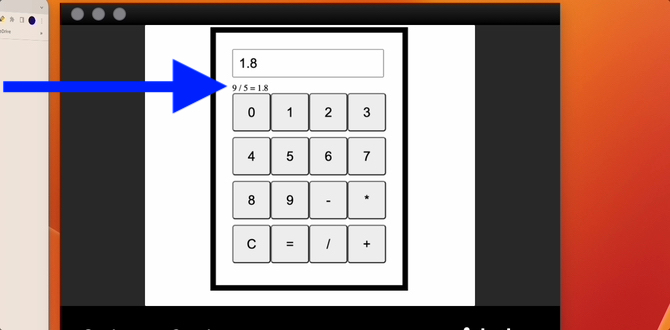

 

<details>
  <summary>Define a variable called 'inputBox' and assign it the HTML element with an ID of "input-box" from your HTML file. This element is where the user will enter numbers and where the results of calculations will be displayed.</summary>

```js
let inputBox = document.getElementById("input-box");

```
</details>

<details>
  <summary>Define a variable called 'buttonContainer' and assign it the HTML element with an ID of "button-container" from your HTML file. This element is where the buttons for the calculator will be displayed. </summary>

```js
let buttonContainer = document.getElementById("button-container");

```
</details>

<details>
  <summary>Create an array called operations and initializes it with the arithmetic operators (+, -, *, and /), the clear button ("C"), and the equals button ("="). </summary>

```js
let operations = [ "-","*", "C", "=", "/", "+"]

```
</details>

<details>
  <summary>Create a variable called 'operator' and initialize it as an empty string. This variable will be used to store the arithmetic operator (+, -, *, or /) depending on what the user is going to select.</summary>
  
```js
let operator = "";

```
</details>

<details>
  <summary>Create 3 variables called 'num1' , 'num2' & 'result' and initialize them as 0.
   'num1' = will be used to store the first number entered by the user, 'num2' = will be used to store the second number entered by the user,  'result' = will be used to store the result of the operation. </summary>
  
```js
    let num1 = 0;
		let num2 = 0;
    let result = 0;
```
</details>


<details>
  <summary>Create a function that takes a number as a parameter and adds it to the inputBox element. It is called whenever the user clicks on a number button on the calculator.</summary>
  
```js
 function addNumber(num) {
			inputBox.value += num
		}
```
</details>

<details>
  <summary>
Create a function that takes an operator (+, -, *, or /) as a parameter. 
1. First it stores the value in inputBox as an integer in the num1 variable. 
2. It then clears the inputBox element.
3. Sets the operator variable to the input parameter. 
This function is called whenever the user clicks on an operator button.

</summary>
  
```js
function addOperator(op) {
			num1 = parseInt(inputBox.value);
			inputBox.value = "";
			operator = op;
		}

```
</details>


<details>
  <summary>Create a function that:
  1. Clears the inputBox element.
  2. Resets the num1, num2 to 0 and stes the operator variable an empty string, respectively). 
  It is called when the user clicks on the "C" button.</summary>
  
```js

function clearInput() {
			inputBox.value = "";
			num1 = 0;
			num2 = 0;
			operator = "";
		}

```
</details>


<details>
  <summary>Create a function that first stores the value of the inputBox as an integer in the num2 variable. 
  Then using a switch statement to determine which operation to perform based on the value of operator, stores the result of the operation in the result variable. 
  It then sets the value of inputBox to the result, sets the value of num1 to the result, sets the value of num2 to 0, and sets the value of operator to an empty string. </summary>
  
```js
function calculate() {
			num2 = parseInt(inputBox.value);
			let result = 0;
			switch (operator) {
				case "+":
					result = num1 + num2;
					break;
				case "-":
					result = num1 - num2;
					break;
				case "*":
					result = num1 * num2;
					break;
				case "/":
					result = num1 / num2;
					break;
				default:
					result = 0;
					break;
			}
			inputBox.value = result;
			num1 = result;
			num2 = 0;
			operator = "";
		}

```
</details>

<details>
  <summary>Create 10 buttons for the numbers 0-9 using a for loop. For each number, it creates a new button element using the document.createElement method. It sets the button's text to the current value of i, adds an event listener to the button that calls the addNumber function with i as an argument, and appends the button to the buttonContainer element.</summary>
  
```js
 for (let i = 0; i < 10; i++) {
			let button = document.createElement("button"); //creates a new button element using the document.createElement method
			button.innerText = i; //It sets the button's text to the current value of i
			button.addEventListener("click",()=>{ //adds an event listener to the button that calls the addNumber function
            addNumber(i) //with i as an argument
            })
			buttonContainer.appendChild(button); //appends the button to the buttonContainer element
		}
```
</details>
<details>
  <summary>Using a for loop  create buttons for the arithmetic operators. For each operation in the 'operations' array, it creates a new button element using the document.createElement method. It sets the button's text to the current operation, adds an event listener to the button that either calls the calculate function (if the button is the equals button) or the addOperator function (if the button is an arithmetic operator), and appends the button to the buttonContainer element.</summary>
  
```js
 for (let i = 0; i < operations.length; i++) { //For each operation in the 'operations' array,
			let button = document.createElement("button"); //creates a new button element using the document.createElement 
			button.innerText = operations[i]; //sets the button's text to the current operation
			button.addEventListener("click",()=>{ //adds an event listener to the button
                if(operations[i] === '='){ //calls the calculate function (if the button is the equals button)
                    calculate()
                }else{
                    addOperator(operations[i]) //the addOperator function (if the button is an arithmetic operator)
                }
            })
			buttonContainer.appendChild(button); //appends the button to the buttonContainer element.
		}
```
</details>

<details>
  <summary>CHALLENGE: Create an element that will display the entire operation after '=' is clicked</summary>

  

</details>