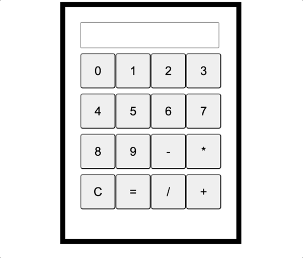

## Simple JavaScript Calculator
# This is a basic calculator program built with HTML, CSS, and JavaScript.

# Features
- Allows users to perform basic arithmetic operations: addition, subtraction, multiplication, and division.
- Users can clear the input box and start a new calculation.
- The program evaluates the expression after the equals sign is clicked and returns the result.
- Dynamically generated buttons for numbers and operators.

# Usage
To use the calculator, simply enter numbers and operators. When you are ready to evaluate the expression, click the equals sign button. To start a new calculation, click the "C" button to clear the input box.

# Limitations
This calculator program is designed for basic arithmetic operations only. It does not support advanced operations such as exponents or trigonometric functions.

# Installation
To use the program, simply download the HTML, CSS, and JavaScript files and open the HTML file in your web browser.

# Technologies Used
- JavaScript
- HTML
- CSS

